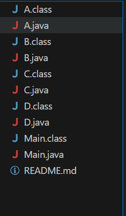

# Hybrid Inheritance in Java

This project demonstrates **Hybrid Inheritance in Java** using interfaces.  
Since Java does not support multiple inheritance with classes, we can achieve it through interfaces.  
Here, interfaces `A`, `B`, and `C` are extended and implemented by class `D`, while the `Main` class acts as the driver.

---

## 📂 Project Structure



## 📖 Code Example

```java```

public class Main {
    public static void main(String[] args) {
        D obj = new D();
        obj.show();      // From A
        obj.display();   // From B
        obj.print();     // From C
        obj.check();     // From D
    }
}
---
## ▶️ How to Run

**Compile the code:**
```bash```
javac Main.java


**Run the program:**
java Main

---
## ✅ Expected Output
Showing from A
Displaying from B
Printing from C
checking from D
